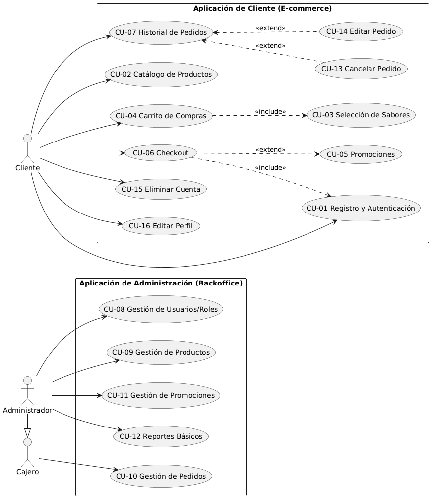

# Rumba Habana — Informe de Presentación del Proyecto

**Proyecto Seminario Integrador — UTN**  
**Sistema de E-commerce para Heladería Artesanal**

---

## 1. Resumen Ejecutivo

Rumba Habana es una plataforma de e-commerce completa diseñada para una heladería artesanal. El sistema permite a los clientes navegar un catálogo de productos, personalizar sus pedidos con sabores y adicionales, gestionar un carrito de compras, y realizar pedidos con entrega a domicilio o retiro en local.

La plataforma incluye un panel de administración integral que permite gestionar productos, sabores, adicionales, categorías, zonas de envío, pedidos y usuarios. El sistema implementa autenticación segura con JWT, control de acceso basado en roles (cliente/administrador), y un flujo de estados de pedido con historial completo.

El proyecto fue desarrollado con una arquitectura moderna de tres capas (frontend, API REST, base de datos) orquestada completamente con Docker, garantizando portabilidad y facilidad de despliegue.

---

## 2. Arquitectura Conceptual

El sistema sigue una arquitectura de **tres capas** desacopladas:

```
┌─────────────────────────────────────────────────────────────┐
│                        CLIENTE                              │
│                    (Navegador Web)                          │
└──────────────────────────┬──────────────────────────────────┘
                           │ HTTP / JSON
                           ▼
┌─────────────────────────────────────────────────────────────┐
│                  FRONTEND (Next.js 16)                      │
│  ┌─────────────┐  ┌─────────────┐  ┌─────────────────────┐  │
│  │  Catálogo   │  │   Carrito   │  │  Panel Admin        │  │
│  │  Productos  │  │   Checkout  │  │  Gestión completa   │  │
│  └─────────────┘  └─────────────┘  └─────────────────────┘  │
│         │                │                    │             │
│         └────────────────┴────────────────────┘             │
│                          │                                  │
│                   Cliente HTTP (JWT)                        │
└──────────────────────────┬──────────────────────────────────┘
                           │ HTTP / JSON (Bearer Token)
                           ▼
┌─────────────────────────────────────────────────────────────┐
│              BACKEND (Spring Boot 3 / Java 21)              │
│  ┌─────────────┐  ┌─────────────┐  ┌─────────────────────┐  │
│  │ Controllers │→ │  Services   │→ │   Repositories      │  │
│  │  REST API   │  │  Negocio    │  │   JPA / PostgreSQL  │  │
│  └─────────────┘  └─────────────┘  └─────────────────────┘  │
│         │                │                    │             │
│  ┌─────────────┐  ┌─────────────┐  ┌─────────────────────┐  │
│  │    JWT      │  │   DTOs      │  │  Mercado Pago       │  │
│  │   Auth      │  │  Validation │  │  Webhook            │  │
│  └─────────────┘  └─────────────┘  └─────────────────────┘  │
└──────────────────────────┬──────────────────────────────────┘
                           │ JDBC
                           ▼
┌─────────────────────────────────────────────────────────────┐
│              BASE DE DATOS (PostgreSQL 18)                  │
│     16 tablas · Relaciones · Constraints · Triggers         │
└─────────────────────────────────────────────────────────────┘
```

**Principios arquitectónicos:**
- **Separación de responsabilidades**: cada capa tiene un rol definido
- **Comunicación por API REST**: desacoplamiento total entre frontend y backend
- **Stateless**: el backend no mantiene sesión; la autenticación es por token JWT
- **Persistencia relacional**: modelo de datos normalizado con integridad referencial

---

## 3. Stack Tecnológico

| Capa | Tecnología | Propósito |
|------|-----------|-----------|
| **Frontend** | Next.js 16 (App Router) | Framework React con SSR/SSG, routing y optimización |
| **Frontend** | React 19 | Librería de UI declarativa |
| **Frontend** | TypeScript | Tipado estático para mayor robustez |
| **Frontend** | Tailwind CSS 4 | Framework CSS utility-first |
| **Frontend** | shadcn/ui | Componentes UI accesibles y personalizables |
| **Frontend** | TanStack Query | Gestión de estado del servidor y caché |
| **Frontend** | React Context | Estado global del cliente (auth, carrito) |
| **Backend** | Spring Boot 3.4 | Framework Java para API REST |
| **Backend** | Java 21 | LTS con mejoras de rendimiento |
| **Backend** | Spring Security | Autenticación y autorización |
| **Backend** | JWT (jjwt 0.12) | Tokens de autenticación stateless |
| **Backend** | Spring Data JPA | Abstracción de persistencia |
| **Backend** | Hibernate | Implementación JPA / ORM |
| **Backend** | PostgreSQL 18 | Base de datos relacional |
| **Infraestructura** | Docker + Docker Compose | Orquestación de contenedores |
| **Infraestructura** | pgAdmin 4 | Administración gráfica de la BD |
| **Pagos** | Mercado Pago | Integración de pagos (opcional) |

---

## 4. Infraestructura de Despliegue

El sistema se despliega con **Docker Compose** en 4 contenedores interconectados:

| Servicio | Imagen | Puerto Host | Descripción |
|----------|--------|-------------|-------------|
| `postgres` | `postgres:18` | 5432 | Base de datos principal con volumen persistente |
| `pgadmin` | `dpage/pgadmin4` | 5050 | Interfaz web de administración de la BD |
| `backend` | Maven 3.9 + Java 21 | 8080 | API REST Spring Boot |
| `frontend` | Node 22 + Next.js 16 | 3000 | Aplicación web Next.js |

**Características de la infraestructura:**
- **Red interna Docker**: los servicios se comunican por nombres de servicio (`postgres`, `backend`)
- **Volúmenes persistentes**: `postgres_data`, `maven_cache`, `frontend_node_modules`, `frontend_next`
- **Health checks**: PostgreSQL verifica su salud antes de que backend/frontend se inicien
- **Dependencias ordenadas**: `pgadmin` y `backend` esperan a que `postgres` esté saludable; `frontend` espera a `backend`
- **Perfiles de configuración**: el backend soporta perfiles `local`, `docker` y `prod` para diferentes entornos
- **Variables de entorno**: todos los secretos (contraseñas, JWT, tokens) se gestionan vía `.env`

---

## 5. Infraestructura de la Base de Datos

### 5.1 Diagrama Entidad-Relación


### 5.2 Descripción del Modelo de Datos

El modelo relacional consta de **16 tablas** organizadas en los siguientes dominios:

**Gestión de Usuarios y Acceso:**
- `usuario` — credenciales de acceso, email único, estado activo/inactivo
- `rol` — roles del sistema (ADMIN, CLIENTE)
- `cliente` — datos específicos de clientes (extiende a usuario)

**Catálogo de Productos:**
- `categoria` — categorías de productos con flag `requiere_sabores`
- `producto` — productos con precio base, stock de envases y máximo de sabores
- `sabor` — sabores disponibles con stock de baldes
- `adicional` — adicionales con precio extra
- `producto_sabor` — relación N:M entre productos y sabores permitidos

**Carrito de Compras:**
- `carrito` — carrito activo por cliente
- `carrito_item` — ítems del carrito con cantidad
- `carrito_item_sabor` — sabores seleccionados por ítem
- `carrito_item_adicional` — adicionales seleccionados por ítem

**Pedidos y Pagos:**
- `pedido` — cabecera de pedido con total, método de entrega y estado
- `detalle_pedido` — líneas de pedido con precio histórico
- `detalle_pedido_sabor` — sabores por línea de pedido
- `detalle_pedido_adicional` — adicionales por línea de pedido
- `historial_estado` — auditoría de cambios de estado del pedido
- `pago` — información de pago por pedido (1:1)

**Logística:**
- `direccion` — direcciones de entrega del usuario
- `zona_envio` — zonas de cobertura con costo de envío

**Promociones:**
- `promocion` — códigos de descuento con porcentaje y vigencia

### 5.3 Características Técnicas

- **Integridad referencial**: todas las relaciones tienen constraints de foreign key
- **Auditoría automática**: triggers de `updated_at` en todas las tablas
- **Índices optimizados**: en columnas de búsqueda frecuente (email, fecha, cliente, pedido)
- **Constraints de negocio**: `cantidad > 0`, email único, código de promoción único
- **Borrado en cascada**: en tablas de detalle (carrito_item, detalle_pedido) y producto_sabor

---

## 6. Reglas Clave de Negocio

### 6.1 Gestión de Productos
- Cada producto pertenece a una **categoría** que determina si requiere sabores
- Los productos tienen un **máximo de sabores** seleccionables (`max_sabores`)
- Si la categoría tiene `requiere_sabores = true`, el producto debe tener al menos un sabor seleccionado
- Los sabores y adicionales tienen **stock** y disponibilidad

### 6.2 Carrito de Compras
- Cada cliente tiene **un único carrito activo** (se crea automáticamente)
- Los ítems del carrito pueden tener **sabores y adicionales** asociados
- El carrito se persiste en la base de datos (no solo en el navegador)

### 6.3 Pedidos y Estados
- Los pedidos pasan por un flujo de estados: **PENDIENTE → EN_PREPARACION → EN_CAMINO → ENTREGADO / CANCELADO**
- Solo los pedidos en estado **PENDIENTE** o **EN_PREPARACION** pueden ser cancelados por el cliente
- Cada cambio de estado se registra en el **historial** con fecha, hora y notas
- El pedido captura el **precio histórico** del producto al momento de la compra

### 6.4 Entrega y Logística
- Las direcciones de entrega están asociadas a una **zona de envío**
- Cada zona tiene un **costo de envío** que se suma al total del pedido
- El sistema valida que la dirección esté dentro de una zona de cobertura

### 6.5 Promociones
- Las promociones tienen un **código único** y un **porcentaje de descuento**
- Tienen **fecha de inicio y fin** para controlar su vigencia
- Pueden estar activas o inactivas

### 6.6 Acceso y Roles
- **ADMIN**: acceso completo al panel de administración (productos, sabores, adicionales, categorías, zonas, pedidos, usuarios, reportes)
- **CLIENTE**: puede navegar el catálogo, gestionar su carrito, realizar pedidos y ver su historial

---

## 7. Metodología de Desarrollo

El proyecto se desarrolló de forma **incremental e iterativa**, con entregas funcionales en cada ciclo:

1. **Fase 1 — Base del sistema**: arquitectura inicial, configuración Docker, esquema de base de datos, entidades JPA y repositorios
2. **Fase 2 — Identidad visual**: rebrand completo a "Rumba Habana", paleta de colores, tipografía Playfair Display + Montserrat
3. **Fase 3 — Catálogo y productos**: CRUD de productos, categorías, sabores y adicionales; restricción de sabores por producto
4. **Fase 4 — Carrito de compras**: gestión del carrito con persistencia en BD, selección de sabores y adicionales
5. **Fase 5 — Checkout y pedidos**: flujo de compra con dirección, zona de envío, método de entrega y confirmación
6. **Fase 6 — Autenticación y seguridad**: JWT, roles, protección de endpoints, registro de usuarios
7. **Fase 7 — Panel de administración**: dashboard, gestión de pedidos con cambio de estado, CRUD completo de entidades
8. **Fase 8 — Funcionalidades avanzadas**: promociones, reportes, historial de pedidos, gestión de direcciones, integración Mercado Pago

---

## 8. Patrones de Diseño Aplicados

### 8.1 Patrones Arquitectónicos (Backend)

| Patrón | Implementación | Beneficio |
|--------|---------------|-----------|
| **Layered Architecture** | Controllers → Services → Repositories | Separación de responsabilidades |
| **Repository Pattern** | Spring Data JPA Repositories | Abstracción de persistencia |
| **DTO Pattern** | Request/Response DTOs | Desacoplamiento entre API y entidad |
| **Service Layer** | Clases `@Service` con `@Transactional` | Lógica de negocio centralizada |
| **Dependency Injection** | Constructor injection (Spring) | Testabilidad y bajo acoplamiento |

### 8.2 Patrones de Seguridad

| Patrón | Implementación | Beneficio |
|--------|---------------|-----------|
| **JWT (JSON Web Tokens)** | `JwtTokenProvider` + `CustomJwtAuthenticationConverter` | Autenticación stateless |
| **RBAC (Role-Based Access Control)** | `@PreAuthorize` con roles | Autorización granular |
| **BCrypt Password Encoding** | Spring Security Crypto | Almacenamiento seguro de contraseñas |

### 8.3 Patrones de Datos

| Patrón | Implementación | Beneficio |
|--------|---------------|-----------|
| **Active Record (ligero)** | `@PrePersist` / `@PreUpdate` en entidades | Auditoría automática de timestamps |
| **Composite Key** | `@IdClass` en tablas de detalle | Identidad compuesta para N:M con atributos |
| **Soft Delete** | Flag `activo` / `disponible` | Eliminación lógica sin pérdida de datos |

### 8.4 Patrones de Frontend

| Patrón | Implementación | Beneficio |
|--------|---------------|-----------|
| **Context API** | `AuthContext`, `CartContext` | Estado global sin prop drilling |
| **Custom Hooks** | `useAuth`, `useCart` | Lógica reutilizable |
| **Server State Management** | TanStack Query | Caché, refetching y sincronización |
| **Component Composition** | shadcn/ui + composición | UI flexible y accesible |

### 8.5 Manejo de Errores

| Patrón | Implementación | Beneficio |
|--------|---------------|-----------|
| **Global Exception Handler** | `@RestControllerAdvice` | Respuestas de error consistentes |
| **Custom Exceptions** | `BusinessRuleException`, `ResourceNotFoundException` | Errores semánticos del dominio |

---

## 9. Diagramas del Sistema

### 9.1 Diagrama de Casos de Uso (DCU)



**Descripción:** El DCU identifica los actores del sistema (Cliente y Administrador) y sus interacciones. El Cliente puede navegar el catálogo, gestionar su carrito, realizar pedidos, ver su historial y administrar su perfil. El Administrador gestiona el catálogo completo (productos, sabores, adicionales, categorías), las zonas de envío, los pedidos (con cambio de estado) y los usuarios del sistema.

### 9.2 Diagrama de Clases


**Descripción:** El diagrama de clases modela las entidades principales del dominio, sus atributos, relaciones y cardinalidades. Incluye la jerarquía de usuarios (Usuario → Cliente), el catálogo de productos (Categoría → Producto → Sabor/Adicional), el carrito de compras y el flujo de pedidos con su historial de estados.

### 9.3 Diagrama Entidad-Relación


**Descripción:** El DER representa el modelo relacional implementado en PostgreSQL. Muestra las 16 tablas, sus atributos, claves primarias y foráneas, y las relaciones entre entidades. Es la base para la generación del esquema SQL de la base de datos.

---

## 10. Conclusiones

Rumba Habana es un sistema de e-commerce completo y funcional que resuelve las necesidades de una heladería artesanal premium. La arquitectura desacoplada, el stack tecnológico moderno y la infraestructura Docker garantizan que el sistema sea:

- **Escalable**: la separación de capas permite escalar cada componente independientemente
- **Mantenible**: el código sigue patrones reconocidos y está bien documentado
- **Portable**: Docker Compose permite levantar todo el stack con un único comando
- **Seguro**: autenticación JWT, control de acceso por roles y contraseñas encriptadas
- **Extensible**: la arquitectura modular facilita la adición de nuevas funcionalidades

El proyecto cumple con los objetivos del Seminario Integrador, integrando conocimientos de desarrollo web, bases de datos, seguridad y despliegue en una aplicación real y funcional.
